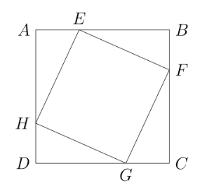
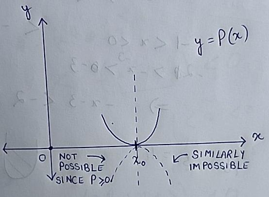

import Lemma from '../../components/theorems/Lemma.astro';
import Theorem from '../../components/theorems/Theorem.astro';
import Claim from '../../components/theorems/Claim.astro'

This is my first blog post and I know this is going to be a
long one, but I really really want to deliver the best 
content for the students who are enthusiastic about
mathematics and want to learn how to solve these types of 
problems, which are not covered typically in schools or JEE 
preparation. I'd first like to list all the problems and then we will begin the discussion.

# ⚔️ Problems

1. The problem is in two parts.

	a) Let $a, b \in \mathbb{R}$ be such that the straight line $y = a + bx$ on the $(x, y)$-plane passes through $(x_1, y_1)$ and $(x_2, y_2)$. If $x_1, y_1, x_2, y_2$ are rational numbers with $x_1 \neq x_2$ and $y_1 \neq y_2$, show that $a$ and $b$ are rational numbers and $b \neq 0$.

	b) Let $\alpha, \beta, r \in \mathbb{R}$ be such that $r > 0$ and the circle $(x - \alpha)^2 + (y - \beta)^2 = r^2$ on the $(x, y)$-plane passes through $(x_1, y_1)$, $(x_2, y_2)$ and $(x_3, y_3)$. Assume that $x_1, x_2, x_3$ are distinct rational numbers, and $y_1, y_2, y_3$ are distinct rational numbers. Show that $\alpha$ and $\beta$ are rational numbers.

2. Sketch, with reasoning, the graph of $y = (\log_e x)^2 + (\log_e x)^{-2}$.

3. Suppose $n \geq 2$ is an integer. Define
$$
S = \{(x_1, \dots, x_n) : 0 < x_i < 1 \text{ for all } i = 1, \dots, n\}
$$
and a function $f\colon S \to \mathbb{R}$ by
$$
f(x_1, \dots, x_n) = \log_{x_1} ((x_2)^2) + \dots + \log_{x_{n-1}} ((x_n)^n) + \log_{x_n} x_1.
$$
Determine the minimum value of $f(x_1, \dots, x_n)$ over $S$.

4. Suppose $f\colon \mathbb{R} \to \mathbb{R}$ is a twice
differentiable function such that
$$
f(x + y) + f(x - y) = 2(f(x) + f(y)) \text{ for all } x, y \in \mathbb{R}.
$$
	a) If $f'$ denotes the derivative of $f$, show that
$$
f'(x + y) - f'(x - y) = 2f'(y) \text{ for all } x, y \in \mathbb{R}.
$$
	b) Further assume that $f''(0) = 2$, where $f''$ is the second derivative of $f$. Determine $f$.

5. In the figure below, $ABCD$ is a square. The points $E, F, G, H$ lie on $AB, BC, CD, DA$, respectively, such that $EFGH$ is a square. The perimeter of $ABCD$ exceeds the perimeter of $EFGH$ by 32 units. Determine the length of the radius of the in-circle of $\Delta EBF$.

6. Let $P$ be a polynomial of degree greater than or equal to one, with real coefficients, such that $P(x) \geq 0$ for all $x \in \mathbb{R}$.

	a) Suppose $x_0 \in \mathbb{R}$ is such that $P(x_0) = 0$. Show that there exist a positive integer $n$ and a polynomial $S$ with real coefficients such that $S(x_0) \neq 0$ and
$$
P(x) = (x - x_0)^{2n} S(x) \text{ for all } x \in \mathbb{R}.
$$
	b) Hence or otherwise, show that there exist polynomials $Q$ and $R$ with real coefficients such that $R(x) > 0$ for all $x \in \mathbb{R}$ and
$$
P(x) = (Q(x))^2 R(x) \text{ for all } x \in \mathbb{R}.
$$

7. Suppose $P$ is a polynomial with integer coefficients.

	a) Show that for distinct integers $m$ and $n$, $\dfrac{P(m) - P(n)}{m - n}$ is an integer.

	b) Hence or otherwise, prove that there do not exist distinct integers $a, b, c$ such that
$$
P(a) = b, \quad P(b) = c, \quad \text{and} \quad P(c) = a.
$$

8. Let $k$ be a non-negative integer.

	a) Show that there exists a unique polynomial $P_k$ of degree $k+1$ with real coefficients such that
$$
\sum_{i=1}^{n} i^k = P_k(n) \text{ for all } n \geq 1.
$$
	b) Determine the coefficient of $x^{k+1}$ in $P_k(x)$.

	c) Hence or otherwise, determine the coefficient of $x^k$ in $P_k(x)$.

## 📌 Problem 1

We will start with **part a)**. Since we know that
$(x_1,y_1)$ and $(x_2, y_2)$ both lie on the line 
$y = a + bx$, putting these coordinates will satisfy the 
equation. This is simplest way to use the problem constraint.
This gives, 
$$
\begin{align*}
y_2 = a + bx_2 \\ 
y_1 = a + bx_1
\end{align*}
$$
where we know that $x_1, x_2, y_1, y_2$ all are rational.
A very simple thought from here on, is to subtract the above
equations. This gives $y_1 - y_2 = bx_1 - bx_2$. Clearly, 
we want to factor out the $b$ from LHS, to get 
$$
y_1 - y_2 = b(x_1 - x_2)
$$
From here, if $x_1 - x_2 \ne 0$(this is actually true, since 
we are given that $x_1 \ne x_2$), then we can divide both
sides by $x_1 - x_2$ and we would get $b = \dfrac{y_1 - y_2}{x_1 - x_2}$. Well, is this fraction rational? If so, we 
would be done.

It turns out that its trivially a rational, the denominator 
$x_1 - x_2 \in \mathbb{Q}$ since both $x_1$ and $x_2$ are 
rational. The denominator is non-zero as well, so we are 
really done! One needs to check the rationality of numerator 
of numerator as well, but well again, difference of two 
rational numbers is always rational! So, we have 
proven $b \in \mathbb{Q}$. What about $a$? Look at the 
equation $y_1 = a + bx_1$. One can conclude that
$a \in \mathbb{Q}$(find out how! its easy!) Let's move to
the next part.

**Part b)** has a similar flavour, it says there are three 
rational points(by rational points, we mean both coordinates 
are rational) on a circle. We are required to show that 
the center has rational coordinates as well.

A simple and naive way, could be to put $(x_1, y_1)$,
$(x_2, y_2)$ and $(x_3, y_3)$ back in the equation and then 
hope for something(maybe some cancellations like last problem
?) Before going too deep into calculations, we should look 
at the setup from a high level. We will call points
$P_1 = (x_1, y_1)$ and similarly define $P_2, P_3$. We are 
given that the circle passes through 3 points, therefore 
its circumcenter is pre-determined. Therefore, if we
try to mindlessly solve some equations, we should be able 
to extract $\alpha, \beta$ individually.

It is obviously possible to put the coordinates of
$P_1, P_2, P_3$ into the equation and bash out the values 
of $\alpha$ and $\beta$. But we will try to find a more 
geometric approach, which comes from the proof of the 
fact that three distinct non-collinear points on the plane
has a unique circle passing through them. 

Note that the perpendicular bisector of $\overline{P_1P_2}$
would pass through $(\alpha, \beta)$\[the motivation to 
consider this, comes from the proof of existence of
circumcircle of a triangle\]. Similarly, the perpendicular 
bisector of $\overline{P_2P_3}$ would pass through
$(\alpha, \beta)$ as well. So, if we can write down the
equation of the perpendicular bisectors then we can solve 
the linear equations in two variable, and we would be done!

Luckily, this is feasible. We can find the slope of 
perpendicular bisector of $\overline{P_1P_2}$ easily it is
exactly 
$$
-\frac{1}{\text{slope of }P_1P_2} \in \mathbb{Q} \qquad \text{(because you can find that slope of $P_1P_2 \in \mathbb{Q}$ and is non-zero)} 
$$

Note that the perpendicular bisector of $P_1P_2$ will 
pass through $\left( \dfrac{x_1 + x_2}{2}, \dfrac{y_1 + y_2}{2}\right)$, which is a rational point. If the equation 
of the perpendicular bisector is $y = mx + c$, then we 
already know $m$, by putting the midpoint of $P_1P_2$, then 
we can find out $c$, which will be rational(easy to see when 
you crunch the numbers).

*The main discovery* is that equation of the perpendicular 
bisector has both slope and $y$-intercept both rational. If
you solve both the equations, there is no way you get an 
irrational point! This concludes the problem.

## 📌 Problem 2

Ahh, I think this one is easily the most deceptive 
problem of the test and scoring full marks on this problem
is going to be quite hard since there is quite a lot to do.

As you transition into higher math, you 
would usually use $\log(x)$ to denote the logarithm with 
base $e$, but for this problem, we'll use $\ln(x)$ for 
the natural logarithm with base $e$. We basically want 
to graph the function $f(x) = (\ln x)^2 + (\ln x)^{-2}$.

Personally, whenever you are attempting to make a graph 
of any function, you should do the following.

1. Determine the **domain** and **range** of the
function $f$.

2. Finding all the **roots/zeroes** of function $f$ or at
least estimating them, if there is no *nice* closed form
solution.

3. Find all it **asymptotes**, if there are any. Usually occurs
when the denominator becomes $0$, but there are other cases
too. You can read more about it
[here on wikipedia](https://en.wikipedia.org/wiki/Asymptote).

4. Find all **critical points** of the function $f$(a point 
$x_0$ is said to be critical if $f'(x_0) = 0$ or $f$ isn't 
differentiable at $x_0$)

5. Find all the **global and local maxima/minima**  of the 
function.

5. **Monotonicity**, find out the intervals, where the
function is increasing or decreasing.

6. **Convexity/Concavity**, finding out the interval 
where the function is convex/concave(as an
oversimplification, the sign of $f''$).

Let us start with the **domain and range**. The domain is 
quite is easy, it is simply $\mathbb{R}_{>0}\setminus \{1\}$
since $(\ln x)^2$ has range $\mathbb{R}_{>0}$ and
$1/(\ln x)^2$ has domain $\mathbb{R}_{>0} \setminus \{1\}$, 
where we remove $1$ to keep the denominator non-zero. The 
range is slightly trickier, although with the aid of
*AM-GM Inequality* on $(\ln x)^2$ and $1/(\ln x)^2$(both 
are non-negative), you can at least see that $f(x) \ge 2$
for all $x$ in its domain.

Clearly, there are no **zeroes** of this function $f$,
which is quite easy to check. The **vertical asymptote**
can only occur at $x = 1$ and $x = 0$ since these 
are the only points where the function collapses. It 
is easy to check that 
$$
\lim_{x \to 0^+} f(x) = \lim_{x \to 0^+} \left((\ln x)^2 + \frac{1}{(\ln x)^2}\right) = +\infty = \lim_{x \to 1^-} f(x) = \lim_{x \to 1^+} f(x)
$$

which easily tells us the shape of graph of $f$ around the
straight lines $x = 1$ and $x = 0$. To check the
**critical points**, we will now take the derivative of
$f(x)$ to find the critical points. The function is
differentiable in its domain, so taking a derivative gives
$$
f'(x) = 2\ln x \cdot \frac 1 x - 2\frac{1}{(\ln x)^3} \cdot \frac 1 x = \frac 2 x \left(\ln x - \frac{1}{(\ln x)^3}\right)
$$

Solving a simple equation from here, we will get that 
$f'(x) = 0 \iff x = e \,\,\text{or}\,\, \frac 1 e$. Also, 
note that under $f$'s domain
$$
f'(x) > 0 \iff \frac 2 x \left(\ln x - \frac{1}{(\ln x)^3}\right) > 0
$$

Since $x > 0$ in our domain, we now need to solve 
$\frac{(\ln x)^4 - 1}{(\ln x)^3} > 0$. The neat trick(very 
standard though) is to multiply both sides by $(\ln x)^6$
which is non-negative, so sign of inequality doesn't change.
This gives $(\ln x)^3 \left((\ln x)^4 - 1 \right) > 0$. 
From here, putting $u = \ln x$, this is a standard
inequality to solve, which upon solving yields
$$
f'(x) > 0 \iff x \in \left( \frac 1 e , 1\right) \cup (e,\infty)
$$

which basically gives us that $f$ is increasing over 
$\left(\frac 1 e, 1 \right)$ and $(e,\infty)$. Also, 
from here we can conclude that $f$ decreases on
$\left(0, \frac 1 e \right)$ and $(1,e)$. With this 
information, applying the *first-derivative test*, we can 
verify that both at $x = e, \frac 1 e$ are global minima. 
At both the points $x = e, \frac 1 e$, $f(x) = 2$. With all 
these facts with us, let's sketch a rough graph without 
considering the convexity.

import rough_graph_f from './isi_2026_discussion/rough_graph.png';

<figure>

<figcaption class="center"><b>Figure.</b>&nbsp;Rough sketch of f(without curvature)</figcaption>
</figure>

Finally, lets evaluate the second derivative of $f$.
Differentiating $f'(x)$ we get(we'll skip the details since 
its just a boring routine differentiation calculation)
$$
f''(x) = \frac{2}{x^2} \left(1 - \ln x + \frac{1}{(\ln x)^3} + \frac{3}{(\ln x)^4} \right)
$$

where $x \in \mathbb{R}_{>0} \setminus \{1\}$. Once again
when is $f'' > 0$? Multiplying both sides by 
$\frac{x^2}{2}\cdot (\ln x)^4$, gives
$$
f''(x) > 0 \iff (\ln x)^5 - (\ln x)^4 - \ln x - 3 < 0 \,\,\text{(where $x > 0$ and $x \ne 1$)}
$$

Substitute $u = \ln x$, because we see a polynomial 
in $\ln x$. Finally, we need to analyze when 
$u^5 - u^4 - u - 3 < 0$. Call this polynomial $h(u)$. Note
that this is the final part of the problem, we just need to 
figure it out when when $h(u)$ positive or negative. 
Before doing anything, we should try to find out a 
few values of $h$, like maybe $h(1)$, $h(2)$, $h(0)$ and 
stuff, basically find out $h$ around $0$, although we 
don't really get much from it. With nothing left at hand, 
we will differentiate $h$ to find out nature of
monotonicity of $h$.
$$
h'(x) = 5x^4 - 4x^3 - 1
$$
Even the derivative looks obscure... Trying a few values 
like $h'(0),h'(1)$ might help... Oh! $h'(1) = 0$. So, with 
the division algorithm we get
$h'(x) = (x-1)(5x^3 + x^2 + x + 1)$. Now, its quite 
clear that $h'(u) > 0$ for $u > 1$. So, $h$ is increasing
over $(1,\infty)$. This is a LOT of progress at hand.

We do need to find the nature of $h'$ on $(-\infty,1)$ as 
well. Can we somehow get a handle on the roots of 
$5x^3 + x^2 + x + 1$? Let's try differentiating this one, 
we would get $15x^2 + 2x + 1$... Can we comment on the 
sign of the derivative? Well, after completing the square
or implementing any method of your liking, its very easy 
to see that this this is always positive! This means 
$5x^3 + x^2 + x + 1$ is always increasing! But this is a 
cubic polynomial, so it must have at least one root. 
Due to its strictly increasing nature, it must have 
**only one root**. I think before proceeing we should try 
to get an estimate. If we call $r(x) = 5x^3 + x^2 + x + 1$,
then $r(0) = 1$, $r(-1) = -4$. Ah! The polynomial
changes sign! So by the *Intermediate Value Theorem(IVT)*, 
the root(call it $\alpha$) must lie between $-1$ and $0$.
So, by *factor theorem*
$$
5x^3 + x^2 + x + 1 = (x-\alpha)P(x)
$$
where $P(x)$ is a quadratic polynomial. This quadratic
polynomial can't posses a root since $r(x)$ only one single 
root. It can be either strictly positive or negative. By
comparing the leading coefficient, one can easily say that
$P$ must be strictly positive.

Analyzing the sign of the derivative is quite easy now. 
We now know that $h$ is strictly increasing over
$(1,\infty)$, we also know that
$h'(x) = (x-\alpha)(x-1)P(x)$, solving for $h'(x) > 0$ 
we get that $x \in (-\infty, \alpha) \cup (1,\infty)$. So, 
$h$ is decreasing over $(\alpha, 1)$. Before proceeding, 
we should make a rough-graph of $h$.

import graph_h from './isi_2026_discussion/graph_of_h.png';

<figure>

<figcaption class="center"><b>Figure.</b>&nbsp; Rough sketch of h</figcaption>
</figure>

As you see can see above, we know $h(1) = -4$ and we know 
there exists some root of $h$ in $(1,\infty)$. We also 
know there is a local maxima of $h$ around $\alpha$, but 
we are unsure whether $h(\alpha) < 0$ or $h(\alpha) > 0$...

I'll admit is blatantly. Beyond this point, *I myself got
stuck.* I looked online, basically on YouTube. But 
what I found was, everyone hand-waved this part without 
paying much attention. I'd rather admit I wasn't able 
to solve the problem, but I'm here learning stuff with 
you guys. *Here's a very magical claim, which I got by 
graphing $h$ on graph on Desmos and some AI asistance.*

<Claim title="Computer Sorcery">$h(x) < 0$ for all $x < 0$. </Claim>

We will make two cases, whether $x \in (-\infty, -1)$ or 
$(-1,0)$ or $x = -1$. The case $x = -1$ can be just checked
by hand.
 

If $x < -1$, then $x^4 > 1 \iff x^4 - 1 > 0$. This gives 
$x(x^4-1) < 0$. Then
$$
h(x) = x^5 - x^4 - x - 3 = x(x^4-1) - (x^4 + 3) < -(x^4 + 3) < 0.
$$

This completes the proof to the first case. For the second 
case, assume $-1 < x < 0$. This gives $-2 < x-1 < -1$ and 
$-3 < -x - 3 < -2$. Then
$$
h(x) = x^5 - x^4 - x - 3 = x^4(x-1) - x - 3 < -x^4 - x - 3 < -x^4 - 2 < 0
$$
this concludes the proof.

Yes, I completely agree the above proof had almost
no-motivation. The claim itself is quite hard to come up
with without a computer/calculator. The proof itself is 
some algebraic manipulation which honestly is quite hard in 
the heat of examination, although it could be done. This
indeed would take a lot of hit and trial to come up with
the right bounds and thus I would not give any motivation
for this, it only requires very standard inequality facts
but its extremely ingenious!

With this, we can now complete the graph of $h$ which 
we drew above and then we can finally conclude that 
$h$ is positive over $(-\infty, \beta)$ and negative 
on $(\beta, \infty)$. Also, do note that since $h(1) = -4$
and $h(2) = 11$, with *Intermediate Value Theorem(IVT)* 
we can say that $1 < \beta < 2$.

To finish it off, we know now that
$$
f''(x) > 0 \iff h(\ln x) < 0 \iff \ln x \in (-\infty, \beta)\setminus \{0\}.
$$
Since $\ln$ is a continuous and monotonically
increasing function, we can write
$$
f''(x) > 0 \iff x \in \left( \exp(-\infty), \exp(\beta)\right) \setminus \{e^0\} = (0,e^{\beta}) \setminus \{1\}
$$
This finishes off the analysis for curvature and the
solution. We'll attach two images, one image will be 
hand-drawn for reference what to be drawn in exam and one
is a computer-generated graph for fun!

import graphImg from './isi_2026_discussion/final_graph_handmade.png';
import computer_Graph from './isi_2026_discussion/computer_graph.png'

<figure>

<figcaption class="center"><b>Figure.</b>&nbsp; Hand-made graph of f </figcaption>
</figure>

<figure>

<figcaption class="center"><b>Figure.</b>&nbsp;Computer generated graph of f</figcaption>
</figure>

## 📌 Problem 3

Okay, the notation might be a bit scary for some people. 
So, we'll go bit slowly. The definition of set $S$ just 
says that we are storing all the ordered tuples 
of the form $(x_1,x_2, \dots, x_n)$ where every entry 
say $x_i$ strictly lies between $0$ and $1$ in the 
set $S$. Then we define a function $f$ which takes 
input from $S$ and gives output in $\mathbb{R}$,
basically we are given a function which takes multiple
input values to give a single real output. Then basically 
you have to minimize the quantity
$$
\log_{x_1} ((x_2)^2) + \dots + \log_{x_{n-1}} ((x_n)^n) + \log_{x_n} x_1.
$$
where every $x_i$ is between $0$ and $1$.

At first glance, you just wonder what even is written 
here? The pattern is a little bit weird to write down.
More concretely, how would you write this sum in a 
proper summation formula with $\sum$ with proper indexing 
and stuff? That's quite a good question, which you might 
want to address. 

Well, we will skip that question for now. Looking at the 
problem for a general $n$ looks scary, so we resort to 
first looking at small base cases to at least be able 
to see what is really happening here. We will start with 
$n = 2$. If you understood what the sum was written well, 
then you should realize that you need maximize 
$$
\log_{x_1}(x_2^2) + \log_{x_2}(x_1)
$$
where $x_1, x_2 \in (0,1)$. This looks like an optimization 
problem with just two variables. We can immediately 
see that we can just put write
$\log_{x_1}(x_2^2) = 2\log_{x_1}(x_2)$. The next step just 
needs the student to know a bit of logarithmic manipulation
and I feel is quite standard if the student has spent at 
least sometime learning about logarithms. Basically, all I 
want to say is that quick change of base formula for 
logarithms, gives you that
$\log_{x_2}(x_1) = 1/\log_{x_1}(x_2)$. Why would you do 
this? Well, you want all the logarithms to have 
the same base to make life easier and apply your 
standard logarithm formulas. We now just need to minimize 
$$
2\log_{x_1}(x_2) + \frac{1}{\log_{x_1}(x_2)}
$$

Minimizing these kind of things(by things I mean, something
of the form $2a + \frac{1}{a}$ where $a$ varies over 
$\mathbb{R}_{>0}$) is generally done using the 
*AM-GM Inequality* and this is a very standard method. 

Although, here one needs to verify if $\log_{x_1}(x_2)$ is 
positive or not under the constraint that both $x_1,x_2$ 
lie in $(0,1)$. Here's a pretty cool thing, if 
$\log_{x_1}(x_2)$ is negative, then $1/\log_{x_1}(x_2)$ is 
also negative. So, even if these things turn out to be 
negative, we can apply *AM-GM Inequality* on
$-2\log_{x_1}(x_2)$ and $-\frac{1}{\log_{x_1}(x_2)}$, 
although results will be different(can you guess what 
will be different?)
 

Anyways, if $\log_{x_1}(x_2) < 0$, then since 
$g(x) = x_1^x$ is a decreasing function in $x$(since 
$0 < x_1 < 1$), we would get
$(x_1)^{\log_{x_1}(x_2)} > (x_1)^0$,
which gives $x_2 > 1$, which is just wrong since we are
given that $x_2 < 1$. So, safely applying *AM-GM Inequality*
yields
$$
2\log_{x_1}(x_2) + \frac{1}{\log_{x_1}(x_2)} \ge 2 \sqrt{2}.
$$

So, we do have a lower bound! But, can the lower bound be 
achieved? Since we applied the *AM-GM Inequality*, the 
bound can be only achieved when
$$
2\log_{x_1}(x_2) = \frac{1}{\log_{x_1}(x_2)} \iff \log_{x_1}(x_2) = \frac{1}{\sqrt{2}} \text{(Why ignore the negative square root?)}
$$

The above thing is only possible when you have 
$x_1^{\frac{1}{\sqrt{2}}} = x_2 \iff x_2^{\sqrt{2}} = x_1$.
Well, can you find $x_1,x_2 \in (0,1)$ which satisfy the
above equation? Its an equation with two variables, so
naturally it should have an infinite number of solutions
but the constraint on $x_1,x_2 \in (0,1)$ makes us question
a bit whether there are _enough solutions_?

Since $x_2 < 1$, so $x_2^{\sqrt{2}} < 1$. So, if we just 
pick some $x_2 < 1$, then $x_1$ must lie in $(0,1)$. So, 
there exists plenty of $x_1,x_2$. So, equality is 
achieved. The $n = 2$ case was easy, what about $n = 3$?

With $n = 3$, we want to minimize
$$
2\log_{x_1}(x_2) + 3\log_{x_2}(x_3) + \log_{x_3}(x_1)
$$

This is much-much worse to deal with. Looking at it, I 
feel that after we solve this, we must be able to look at 
the true nature of the problem. Also, it is way better to 
transform all the logarithms into a common base. That 
way, if we want to apply our logarithm formulae, something 
like $\log_a(xy) = \log_a(x) + \log_a(y)$, then we can do 
it quite comfortably. We will keep the base $x_1$, since 
it appears in the first summand. Applying change of base
gives
$$
2\log_{x_1}(x_2) + 3\cdot\frac{\log_{x_1}(x_3)}{\log_{x_1}(x_2)} + \frac{1}{\log_{x_1}(x_3)}
$$

This has kinda started to look like the previous case 
of $n = 2$. Would applying *AM-GM* inequality work? Actually,
if you take the product of all the summands, you will 
find out that that the product is a constant. A perfect 
opportunity to apply *AM-GM Inequality* once again. It 
gives
$$
2\log_{x_1}(x_2) + 3\cdot\frac{\log_{x_1}(x_3)}{\log_{x_1}(x_2)} + \frac{1}{\log_{x_1}(x_3)} \ge 3\sqrt[3]{2\cdot 3}
$$

Wonderful! We have a candidate lower bound with the 
help of the *AM-GM Inequality*. But if the 
equality is not achieved, then we can't conclusively say 
that this is the minimium value. Once again, 
equality occurs iff 
$$
2\log_{x_1}(x_2) = 3\cdot\frac{\log_{x_1}(x_3)}{\log_{x_1}(x_2)} = \frac{1}{\log_{x_1}(x_3)} = t \,\, \text{(say)}
$$

From here, we know $t = \frac{1}{\log_{x_1}(x_3)}$, 
$t = 3\cdot\frac{\log_{x_1}(x_3)}{\log_{x_1}(x_2)}$ and 
$t = 2\log_{x_1}(x_2)$. Multiply all these equations, to 
get $t = \sqrt[3]{6}$. All of these are tactics a student 
should know, like if there is an equality with 2-3 
$=$ signs, then letting everything equal to a common
variable, $t$ in our case.

Here's the final nail in the coffin. When there is the
equality? We know that $1/\log_{x_1}(x_3) = t$, so we 
may write $x_1^\frac{1}{t} = x_3$. Here's a crucial 
information, the moment you equated $1/\log_{x_1}(x_3) = t$,
you basically fixed the value of $\log_{x_1}(x_3)$. Look
at the summand $3\cdot\frac{\log_{x_1}(x_3)}{\log_{x_1}(x_2)}$,
here when we set this thing equal to $t$, then observe that
we would get $\displaystyle \log_{x_1}(x_2) = 3/t^2 \iff x_1^{\frac{3}{t^2}} = x_2$. The interesting part is that, 
once you try and set $2\log_{x_1}(x_2) = t$, you should 
realize that value of $\log_{x_1}(x_2)$ was already fixed. 
If the earlier value you found, doesn't make
$2\log_{x_1}(x_2) = t$, then there is no equality! Luckily, 
$2\log_{x_1}(x_2) = 2\cdot \frac{3}{t^2} = 6/t^2 = t$ 
since $t^3 = 6$. So, the equality holds, but what for 
what value of $x_1, x_2, x_3$? Well, recall you got the 
conditions $x_1^\frac{1}{t} = x_3$ and
$x_1^{\frac{3}{t^2}} = x_2$. These are the equivalent
conditions for equality. Here, set $x_1$ to be some 
arbitrary number in $(0,1)$, then we hope that $x_2$ and 
$x_3$ also lie in $(0,1)$(yes they do! quite easy to prove).
This finishes the $n = 3$ case as well.

At last, I think we do need a definite pattern to state 
the equality case, how do we do that? We will do a 
general case this time, where we don't fix a 
value of $n$(feel free to try $n = 4$ to get a better 
understanding of what is happening here).I think its
fairly easy to see that the lower bound for a general $n$
with the help of *AM-GM Inequality* is $n\sqrt[n]{n!}$.
The equality occurs precisely when 
$$
2\log_{x_1}(x_2) = \frac{3\log_{x_1}(x_3)}{\log_{x_1}(x_2)} = \frac{4\log_{x_1}(x_4)}{\log_{x_1}(x_3)} = \cdots = \frac{n\log_{x_1}(x_n)}{\log_{x_1}(x_{n-1})} = \frac{1}{\log_{x_1}(x_n)} = \sqrt[n]{n!}.
$$

where the last equality came from our trick of letting 
everything be $t$ and then multiplying equations, just like
what we did in $n = 3$ case. Even for this case, 
let $t = \sqrt[n]{n!}$. We firstly fix
$\log_{x_1}(x_n) = 1/t$, then
$\log_{x_1}(x_{n-1}) = n/t^2$. Similarly, we can find 
that $\log_{x_1}(x_{n-2}) = \frac{n(n-1)}{t^3}$. If the 
student is willing to write down a few terms by hand, 
I think the pattern 
$$
\log_{x_1}(x_{n-k}) = \frac{n\times(n-1)\times\ldots\times(n-k+1)}{t^{k+1}} = \frac{1}{t^{k+1}}\left(\prod_{j = 0}^{k-1} (n-j)\right)
$$
$$
\iff x_1^{\frac{1}{t^{k+1}}\left(\prod_{j = 0}^{k-1} (n-j)\right)} = x_{n-k}
$$

for $k = 0, 1, 2, 3, \dots, n-1$. Finally, pick some $x_1$ 
in $(0,1)$, then $x_2,x_3, \dots, x_n$ will all lie in 
$(0,1)$. This finally completes our solution.

## 📌 Problem 4

In particular, when someone wants to prove **part a)**, then 
its quite natural to differentiate both sides, which is
indeed valid, since $f$ is given to be twice differentiable.
But, how do we even begin to differentiate? There are two 
variables! We have only learned to differentiate when 
there is one variable.

The given functional equation is true for all $x$ and 
all $y$. So, lets fix $y = 1$ for once. Then we would get 
$$
f(x + 1) + f(x - 1) = 2(f(x) + f(1))
$$
YES! Now, there is one variable, if we differentiate with 
respect to $x$, we would get $f'(x+1) - f'(x-1) = 2f'(x)$.
But look at **part a)** again. It wants us to prove
$f'(x + 1) - f'(x-1) = 2f'(1)$\[because we put $y = 1$, so 
for now, we should be able to show this if the conclusion 
is true\], which is something totally different. 

Where did we go wrong!? A good observation is, to note that 
the functional equation, is not symmetric about $x$ and $y$. 
Last time we fixed $y = 1$, this time let's try fixing 
$x = 1$. This would yield, 
$$
f(1 + y) + f(1-y) = 2(f(1) + f(y))
$$
Well, we can only differentiate this with respect to $y$, 
so let's do that. We get $f'(1+y) - f'(1-y) = 2f'(y)$ 
for all $y \in \mathbb{R}$. Let's go! This is what we
wanted to show! We have just proven what we wanted to prove, 
but just for a special case when $x = 1$.

Here's the fun thing, there is no such special thing while 
we take $x = 1$. We could have picked $x = 2026$ and would
have gotten the same result! Therefore, we can directly 
say that if we differentiate both the equations with respect 
to $y$(think that $x$ is constant and completely indepedent 
of $y$), then we get 
$$
f'(x + y) - f'(x - y) = 2f'(y).
$$
which is what we wanted to prove! I think have explained it
well-enough how this works out. People also call this 
*partially differentiating with respect to $y$*. We will 
use the same terminology as well.

We now want to attack **part b)**. This is much more 
interesting, since it wants us to characterize $f$ with 
an additional constraint that $f''(0) = 2$. As a student 
in exam, you might wonder why did they ask me to prove 
**part a)**. You might want to use it. We were told the 
function is twice differentiable, we definitely want to use 
that to our advantage. We can differentiate both sides 
once again. But with respect to what? Well, if you 
partially differntiate with respect to $y$, you get this 
complicated functional equation
$f''(x+y) + f''(x-y) = 2f''(y)$ at the moment seems hard to 
deal with. It might be of use, but before committing to 
dealing with this monster, lets try and differentiate 
with respect to $x$. We will get 
$$
f''(x+y) - f''(x-y) = 0 \iff f''(x + y) = f''(x-y) \, \forall \, x,y \in \mathbb{R}
$$
I think with a little experience, one should know 
immediately what is happening. If you don't, you can always 
manipulate. Just putting $y = x$, gives $f''(2x) = f''(0) = 2$.
Replacing $x$ by $x/2$ in the newfound equation, we get
$f''(x) = 2$ for all $x \in \mathbb{R}$. This is wonderful, 
the second derivative of $f$ is constant on entire
$\mathbb{R}$. Just integrating twice, would yield 
$$
\begin{align*}
f'(x) &= \int 2 \, dx = 2x + C \\
f(x) &= \int (2x+C)\, dx = x^2 + Cx + D
\end{align*}
$$

One still needs to determine the constants $C$ and $D$. This 
can be done by blatantly putting this solution into 
the equation $f(x+y) + f(x-y) = 2(f(x) + f(y))$. We will 
take a smarter approach and try to play a little more with 
the setup. Like, just put $x = y = 0$, you will immediately 
find that $f(0) = 0$, this immediately gives $D = 0$(!)

What if you just put $x = 0$ and let $y$ be free in 
original functional equation? You'd get
$f(y) + f(-y) = 2f(y)$, which upon gives $f(y) = f(-y)$,
which means $f$ is even. But $f(x) = x^2 + Cx$ and we 
just found out $f(x) = f(-x)$, can you now conclude that 
$C = 0$ is forced!? This basically finishes the solution.

We have now found that $f(x) = x^2$ for all
$x \in \mathbb{R}$. Although, as functional equations have 
this rule, that we must check whether the function which 
we have found is satisfying the functional equation. This 
is left as an exercise 😉

## 📌 Problem 5

A lot of the folks might just directly know the formula 
for in-radius of a right-triangle directly which makes 
the problems A LOT easier. I personally knew that too,
but here is another approach, which comes from the formula
$r = \frac{\Delta}{s}$ where $\Delta$ is the area of the 
triangle and $s$ denotes the semi-perimeter.

Let $x$ be the side-length of square $EFGH$. Then by the 
perimeter condition, we get that side-length of square 
$ABCD$ is $x+8$. We wish to compute the in-radius of 
$\triangle EFB$. Applying the formula, we know that
$$
r = \frac{\Delta}{s}
$$
Finding the area of triangle $EBF$ is quite easy, it is 
just $\frac 1 2\times EB \times BF$. The semi-perimeter is
just $\frac{EB + BF + x}{2} = s$. We already see $EB$ 
and $BF$ appear twice, so let's just label it 
for now. We will call $EB = f$ and $BF = e$, with the 
usual naming conventions in $\triangle EBF$. Now, we 
want to simplify
$$
r = \frac{f\times e}{f + e + x}
$$

We for sure need some relations among the variables before 
we proceed for any computation. A very simple relation 
can be obtained by applying Pythagoras Theorem in 
$\triangle EBF$, which gives $e^2 + f^2 = x^2$. This 
kind of helps us get rid of $x$ completely(since we can 
put $x = \sqrt{f^2 + e^2}$ no matter how ugly it is), if we
look at the expression completely algebraically.

Here's the main meat of the problem. Look all the 
side triangles formed, basically $\triangle EFB$, 
$\triangle FGC$, $\triangle GDH$ and $\triangle AEH$. They 
look quite similar on the diagram. I think one reasonable 
guess from the diagram, could be to claim they are 
congruent? Although, we have no clue if its true. We were 
never told that the given diagram is upto scale... 

If you think this way of seeing the diagram and then claiming
that these triangles are congruent can be done only if 
one knows the solution, then we'll present another 
argument which is something you might find in exam. I do 
admit this is quite clumsy and I won't like to present this
in any formal solution, but maybe a more natural way to 
stumble around this congruency fact.

Let $\theta \coloneqq \angle BEF$. We know that
$\angle FEH = 90^\circ$. Soo,
$\angle AEH = 90^\circ - \theta$. This also gives 
$\angle EHA = \theta$.

From here, I think one must be obervant to see 
that two right triangles with same hypotenuse length and a 
common angle $\theta$, are they similar? Are they congruent?
This isn't anything super difficult, but yes one must be 
attentive all the time.

So, how do we prove that the triangles are congruent? 
Well, we know that $EF = EH$. We also know that 
$\angle FEB = \angle EHA = \theta$ and
$\angle EBF = \angle HAE = 90^\circ$. So, with basic 
class 9th standard AAS congruence rule, 
we get that $\triangle EBF \cong \triangle HAE$. So, what 
information do we get? If you list everything out, the 
main information we get is that $AE = BF = e$. Recall we 
had to compute 
$$
r = \frac{f \times e}{f + e + x}
$$
We now know that $f + e = EB + BF = EB + AE = AB = x+8$.
So, everything simplifies into terms of $x$. We just 
want to find the value of $f\cdot e$. We know that 
$f + e = x+8$ and $e^2 + f^2 = x^2$. Simple algebra 
gives us that 
$$
f\cdot e = \frac{(e+f)^2-e^2-f^2}{2} = \frac{(x+8)^2-x^2}{2} = 8x + 32
$$
We can now finally conclude,
$$
r = \frac{f \times e}{f + e + x} = \frac{8x + 32}{x + 8 + x} = \frac{8(x+4)}{2(x+4)} = \boxed{4.}
$$
which finishes our solution. The only challenging part of
the problem was to notice the congruent triangles, which 
is quite doable even in exam conditions if just one calmly 
manipulates the expression they need to simplify. Although, 
I think it should have been clearly mentioned that the
answer is a fixed real number, otherwise it can honestly
leave a student very confused as to where to stop
simplifying. The problem is easy because of the pre-existing 
formulae and like the main observation is not impossible 
because of the given diagram in the paper.

## 📌 Problem 6

This one is my favourite from the exam and I found it to be 
the most elegant problem in exam. We will start with 
**part a)**. 

Well, basically we have a non-negative polynomial $P$ where 
$x_0$ is a root of $P$. What the problem asks you to show 
that any root $x_0$ of $P$ must come with an even 
multiplicity. There is quite a strong and important lemma 
for finding double roots which one must know before-hand.

<Lemma title="Double Roots"> Let $\alpha$ be a root of polynomial $P$, then $\alpha$ is a double root of $P$ if and only if $P'(\alpha) = 0$. </Lemma>

Obviously, $P$ must have an 
even degree, otherwise its impossible for $P$ to be always 
non-negative. If you try to sketch a graph of $P$, you'd
immediately notice that $P$ attains $0$ at $x_0$ and 
then it must start increasing.

Similarly, $P$ must have been 
decreasing to $0$ before $x_0$. This gives us that the 
LHD and RHD(these are right-hand and left-hand derivatives 
respectively) are $\le 0$ and $\ge 0$ respectively. Since 
$P$ is a polynomial, the LHD and RHD must be the same. This 
is only possible if both are $0$, which tells us that 
$P'(x_0) = 0$. From here, we definitely want to invoke our 
lemma and now we can conclude that $x_0$ is a double root 
of $P$.

Well, so $x_0$ is a double root, so maybe we want to apply 
our division algorithm to get that there exists some
polynomial $Q(x)$ such that 
$$
P(x) = (x-x_0)^2 \cdot Q(x)
$$

Wait, there is something interesting happening, if $x_0$ is 
not a root of $Q(x)$, then we are done. We have shown that 
multiplicity of $x_0$ is 2(which is even), which is what we 
wanted. What if $x_0$ is a root of $Q(x)$? Well... We can 
try to apply a similar analysis as to what did before? 
Just if $Q$ was also non-negative, we could have continued 
by factoring out more $(x - x_0)^2$ from $Q$... Wait, 
we know that $P(x) \ge 0$ for all $x \in \mathbb{R}$ and 
of course, $(x-x_0)^2 \ge 0$ for all $x \in \mathbb{R}$! 
This forces $Q$ to non-negative on entire $\mathbb{R}$ as 
well!

Well, since $Q$ has finite degree, this must end sometime. 
We can easily see that $Q$ is even degree, so everytime
the degree decreases by $2$. So, $x_0$ must have an 
even multiplicity, thus, we are done. Although, here's an 
interesting and cleaner way to write this. What if we
decided to induct on degree of $P$? The motivation for this, 
is simple. If $Q$ didn't have $x_0$ as a root, we would have
been done, but if it had $x_0$ as a root, then we get a 
new polynomial $Q$ with a smaller degree, where we have to 
do a similar type of analysis which we did earlier. 

From here, its quite easy to conclude with induction.
Although, the proof-writing needs real-care here. Its very 
easy to write a hand-wavy proof for the problem, which can 
lose points on the exam. Basically, this is what we 
want to prove in the exam.

<Claim>Any non-negative even degree polynomial $P$ if posesses a root $\alpha$, then $\alpha$ must have even multiplicity. </Claim>

Let $\deg(P) = 2d$. We wish to induct on $d$. We first 
need to deal with the base case of $d = 1$. So, consider 
$P$ to have degree $2\cdot 1 = 2$, with a 
root $\alpha$. By the *Factor Theorem*, 
$$
P(x) = (x-\alpha) \cdot (ax + b)
$$

Soo, what we really want to show, is that $ax+b$ also has 
the same root $\alpha$ to prove our base case. Well, 
what if that is not the case? Well, if a quadratic has 
two distinct roots, then just graphing it out, one can see 
that it must be negative at some point of time. 

Alternatively, say a quadratic looks like $a(x-\alpha)\cdot (x-\beta)$, where $a \in \mathbb{R}$ and $\alpha \ne \beta$, 
then just use wavy-curve method, you will always find a 
region where this quadratic turns negative. Therefore, 
two distinct roots are impossible for this quadratic
polyomial, which proves that the hypothesis is true for
the base case.

We'll stop with the solution to **part a)** here, since 
the idea is now quite clear. Now one just needs to 
properly write down the *induction hypothesis* and induct 
properly with the equation $P(x) = (x-x_0)^2Q(x)$.

We will now attack **part b)**. This looks very very similar 
to **part a)**. By the first part, we already know that 
if $P$ posseses a root $x_0$, then we can write
$P(x) = (x-x_0)^{2m} Q(x)$ where $Q(x_0) \ne 0$. So, we have 
factored out one perfect square, and we know that 
$Q$ is also non-negative. If $Q$ posesses no more roots, 
then we are done! If it posseses one more root, say $x_1$, 
then we can factor out that root with even multiplicity, 
and we would get 
$$
P(x) = (x-x_0)^{2m}(x-x_1)^{2m_1}Q_1(x)
$$
Once again, $Q(x)$ is non-negative. If $Q$ doesn't have any
root, then its strictly positive and we would be done! 

Sooo, yeah a similar induction argument like **part a)**
will kill the problem here on the spot. This is almost the
same as what we did earlier. So yeah, induction strikes
again!

## 📌 Problem 7

Okay, I'm totally dissapointed by this problem. This is
basically [USAMO 1974/1](https://aops.com/community/c6h337922p1808245).
This problem is so common and almost 
anybody serious for the entrance must have solved this 
problem once before... Anyways, let's see how to attack 
this.

So, we are basically given that $P \in \mathbb{Z}[x]$(just 
a fancy notation for a polynomial with integer coefficients)
and $m,n \in \mathbb{Z}$. Therefore, its quite obvious 
that $P(m)$ and $P(n)$ are all integers. Essentially, they
want us to show that $m - n \mid P(m) - P(n)$.

So, we are given $P$ has integer coeffcients. Well, the 
most straight-forward way to use this fact is to write 
down this polynomial. If $\deg(P) = d$, then 
$$
P(x) = a_0 + a_1x + a_2x^2 + \dots + a_dx^d
$$
where $a_1, a_2, \dots, a_d$ are all integers. Let's just
compute what $P(m) - P(n)$ actually is. Obviously, 
$a_0$ cancels out.
$$
P(m) - P(n) = a_d(m^d - n^d) + a_{d-1}(m^{d-1} - n^{d-1}) + \dots a_2(m^2-n^2) + a_1(m-n)
$$

So, now we just need to prove $m-n$ divides the RHS of the 
above equation. Obviously $m-n \mid a_1(m-n)$. Also, 
$m - n \mid a_2(m^2 - n^2) = a_2(m+n)(m-n)$. So, can I in 
general say, $m-n \mid m^k - n^k$? If that's true, we would 
be done! Well, there is a well-known identity
$$
m^k - n^k = (m-n)\left(m^{k-1} + m^{k-2}n + m^{k-3}n^2 + \dots + m^2n^{k-3} + mn^{k-2} + n^{k-1}\right)
$$
Since, $m,n$ are integers is obvious that the divisibility 
is true. This completes the proof to the first part. 

Coming to **part b)**, we wish to show there doesn't exist 
$a,b,c$ such that _some condition is true_. So, just assume 
$a,b,c$ exists such that $P(a) = b, P(b) = c$ and
$P(c) = a$. Ofcourse, we want to use **part b)**. Lets try to
use it. This would give us
$$
a-b \mid P(a) - P(b) = b - c.
$$
Similarly with $b - c \mid P(b) - P(c)$ and
$c - a \mid P(c) - P(a)$, we will get the following division 
relations. This gives, 
$$
\begin{align*}
a - b &\mid b - c \\
b - c &\mid c - a \\
c - a &\mid a - b
\end{align*}
$$

Obviously, none of $a-b, b-c, c-a$ none of them are $0$, 
otherwise we get contradiction on distinct-ness of 
$a,b,c$. If you look at these divisibility relations
closely, then you would notice, 
$$
a - b \mid b-c \mid c-a \mid a-b
$$

When is this even possible? Note that, we have a result
that if $x \mid y$, then $|x| \le |y|$ given $x,y \ne 0$.

Applying the same result, we get that 
$$
|a-b| \le |b-c| \le |c-a| \le |a-b| \implies |a-b| = |b-c| = |c-a|
$$
Well, from here... You just need to show somehow that two 
of $a,b,c$ are equal, that will be the desired contradiction.
Let's start by crunching in some numbers, 
$$
|a-b| = |b-c| \implies a-b = \pm (b-c)
$$
because if two numbers have same absolute value, then they 
must be same or would be additive inverses of each other.
If $a-b = -(b-c)$, then we get $c = b$(contradiction, since 
$a$, $b$, $c$ are distinct). So, we get 
$a-b = b-c \implies 2b = a+c$. With the other divisibility 
relations, we will similarly get 
$$
\begin{align*}
2c &= a + b \\
2a &= b + c \\
2b &= a + c
\end{align*}
$$

Just subtract any two equations. Magic will necessarily
happen! The solution is now complete!!

## 📌 Problem 8

We will begin by **part a)**. The biggest red-flag of this 
problem is sooo many god damn variables. You have $n$ and 
then $k$... Nothing seems tangible at this point. I think a 
good way to start on this problem is to fix some variable. 
You definitely shouldn't fix $n$, because we are given 
that $\sum i^k = P_k(n)$ for all $n \ge 1$, this will vary 
throughout. You can definitely fix $k$ though. Lets try 
it out. Let's start by fixing $k = 1$.

If we fix $k = 1$, then we get 
$$
\sum_{i = 1}^n i = P_1(n)
$$
for all $n$. Does there exist some nice polynomial? Yes!
It does exist! We know the formula for first $n$ natural
numbers. We get $P_1(n) = \frac{n(n+1)}{2}$ which has 
exactly degree $2$. Perfect! so, for $k = 1$ there
definitely exists a $2$ degree polynomial. Well, is it 
unique? Could there be any other degree $2$ polynomial $Q(x)$
which matches $x(x+1)/2$ at all $x \in \mathbb{N}$? I don't 
think I can motivate this one, this one should we known 
to the student prior to the exam. Consider the polynomial 
$$
R(x) = Q(x) - \frac{x(x+1)}{2}.
$$
where we have assumed $Q$ is another polynomial where 
$Q(n) = n(n+1)/2$ for all $n \in \mathbb{N}$. If we can 
show that $Q(x) = x(x+1)/2$ for all $x \in \mathbb{R}$
instead of just $x \in \mathbb{N}$, then we would be done.

Here's the magic! $R(1) = 0$, $R(2) = 0$ and $R(3) = 0$. So, 
$R$ as at least $3$ zeroes. But $\deg(R) \le 2$. This is 
impossible unless $R(x)$ is the zero-polynomial!! This proves
the uniqueness of the polynomial. We are done for $k = 1$ 
case.

Well, obviously one would like prove this for
$k = 2,3,4,\dots$ I think we should try a few more examples.
For $k = 2$, we again have a very good formula.
$$
\sum_{i = 1}^n i^2 = \frac{n(n+1)(2n+1)}{6}
$$
You can find out $P_2(x)$ from here. Uniqueness can be proven
once again! Just use that $R(1) = R(2) = R(3) = R(4) = 0$, 
which gives more zeroes. Well, $R$ has infintely many 
zeroes, you can handle uniqueness in genreal for any 
value of $k$. You can try $k = 3$, you again have a good 
formula and you conclude for $k = 3$ as well. There 
are good formulae for $k = 4,5,6$, but what are these? 
Would they remain of the polynomial type? Like, for 
$k = 2$, we get $n(n+1)(2n+1)/6$, which is a polynomial in 
$n$. Are we sure that for $k = 100$, the formula 
would turn out to be a polynomial in $n$? If that is not the 
case, then everything collapses. We need to find a formal 
proof that this formula for $\sum_{i = 1}^n i^k$ is a
polynomial in $n$.

Writing down this proof, takes real experience and requires
one to know their proofs. Do you know how to prove 
$\sum_{i = 1}^n i^3 = (n(n+1))^2/4$? If you do, then 
the later steps are quite automatic, otherwise they are 
truly black magic. Note that 
$$
(i+1)^5 - i^5 = 5i^4 + 10i^3 + 10i^2 + 5i + 1
$$
If you take a sum on both sides from $i = 1$ to $i = n$, 
then by telescopic sums, on the LHS you would simply 
get $(n+1)^5 - 1$. The RHS becomes something much more 
interesting. Writing this properly we get 
$$
(n+1)^5 - 1 = 5\sum_{i = 1}^n i^4 +  10\sum_{i = 1}^n i^3 + 10\sum_{i = 1}^n i^2 + 5\sum_{i = 1}^n i + \sum_{i = 1}^n 1
$$
If you are observant enough, you just want to solve for
$5 \sum_{i = 1}^n i^4$ on the RHS, rest all the formulae 
you already know! After simplifying, one would get 
$$
\sum_{i = 1}^n i^4 = \frac{n(n+1)(2n+1)(3n^2 + 3n - 1)}{30}.
$$
Which is again a polynomial. At this point, an induction
(strong one to precise) on $k$ should be obvious since all
you need is all the previous formulae. This indeed solves
**part a)**. But what about the other parts?

Well, okay lets think about **part b)** and **part c)**
both at once, since both of them want us to find very 
particular coeffcients of the polynomial. First of all, 
if you just experiment with $k = 2,3,4$, you will out 
that the coeffcient of $x_{k+1}$ in $P_k(x)$ is precisely 
$1/2, 1/3, 1/4$ for $k = 2,3,4$. So, its natural to 
conjecture that coefficient of $x^k$ in general is
$\frac{1}{k+1}$. Let's try to justify it. Say you want 
to find a formula for $\sum_{i = 1}^n i^k$, we will use 
the same telescopic black magic! We would then get 
$$
(n+1)^{k+1} - 1 = \binom{k+1}{1}\sum_{i = 1}^n i^k + \binom{k+1}{2}\sum_{i = 1}^n i^{k-1} + \dots + \sum_{i = 1}^n i
$$
We know that we want to solve for $\sum_{i = 1}^n i^k$. We 
know all the formulae for lower degree terms like 
$\sum_{i = 1}^n i^{k-1}, \sum_{i = 1}^n i^{k-2}$, will only
have terms of degree at most $k$. Now, isolate 
$\sum_{i = 1}^n i^k$ to get 
$$
\sum_{i = 1}^n i^k = \frac{1}{k+1}\left((n+1)^{k+1} - 1 - \underbrace{\left( \binom{k+1}{2}\sum_{i = 1}^n i^{k-1} + \dots + \sum_{i = 1}^n i
\right)}_{\text{All terms have degree strictly less than $k+1$}}\right) \tag{$\clubsuit$}
$$

Notice that underbace, due to that logic, just find out 
the coefficient of $n^{k+1}$ from
$\frac{1}{k+1} \cdot ((n+1)^{k+1} - 1)$. It is precisely 
$\frac{1}{k+1}$(!) Awesome, so if you cleverly add this to
your induction hypothesis(since all you need is previous
formulae) for **part a)**, then you can solve **part b)** 
as well! Onto the final boss, **part c)**.

There are two options from here, either you just 
extract the coeffcient directly from the above big equation
with the underbrace, or you start slow and experiment a
little with small values. Try out for $k = 1, 2, 3, 4$,
everytime the coefficient for $x^{k}$ comes out to be 
$1/2$. Soo, we at least know now what should come after
extracting coeffcient of $n^k$ in $(\clubsuit)$.

The underbraced part in $(\clubsuit)$, only has one term 
with $n^k$, that is $\binom{k+1}{2} \sum_{i = 1}^n i^{k-1}$
due to **part b**. By **part b)**, we know the coefficient
of $n^k$ in that term, must be $\binom{k+1}{2}1/k$. We can
ignore the rest of the terms. The coeffcient of $n^k$from
$(n+1)^{k+1}-1$ can be easily found with the help of binomial
theorem, its $k+1$. So at last, the final coefficient of 
$x^k$ is 
$$
\frac{1}{k+1}\left( k+1 - \frac{k(k+1)}{2}\cdot \frac 1 k\right) = \boxed{\frac 1 2}
$$
This finally concludes the solution. Phew, so many
computations, it personally felt like a very long solution. 

Technically speaking after assuming **part a)** and **b)**,
one can solve **part c)**. And the inductive solution,
should cover both **part a)** and **part b)** together.

# Concluding Remarks

These are my final remarks on the problems this year.

1. This first part of the problem is particularly easy 
and I feel it's quite difficult to write a _wrong_ solution.
The second part is significantly more challenging, still 
if done correctly, even blatant computations can give 
a nice answer. There are several methods to solve this 
problem, one can even think of resorting to parametric 
coordinates for the circle, or bash it by putting 
values into the equation of the circle. This problem 
has appeared before which went as follows.

**JEE Advanced(Subjective) 1997:**
Let $C$ be any circle with center $(0,\sqrt{2})$. Prove
that there can be at most two rational points on $C$. A 
point is said to be a _rational point_ if both its 
coordinates are rational numbers.

The taste of the problem is very similar and one who has 
done this problem beforehand can solve it almost 
immediately on exam. Regardless, there are quite a few 
approaches to consider, making the problem at a
**moderate level**.

2. I personally hate this problem. Finding the nature of 
the graph and the global minima and asymptote are typical 
of JEE Mains level these days. Any progress which just 
evaluates the derivative and finds the monotonicity 
of the graph is just routine calculation, which I feel 
should not be on the UGB section...

On the other hand, finding the _curvature of the graph_ 
is stupendously hard. I personally don't know how one is 
supposed to solve that inequality on exam, I think 
even showing that $f$ is concave and convex over certain 
intervals is quite hard! I would put the problem on the 
**easier side** of the exam, if the graders decide to give 
full marks to the people who have just decoded the 
monotonicity and asymptote of the graph. The problem easily
becomes a **hard level problem** if graders penalize the 
students for not finding the curvature of the graph.
Although, after searching through the internet, apparently
a sketch of the graph doesn't require you to find the
curvature of the graph.

3. Ahhh! This one is an _excellent trap_ for students. 
First the language of the problem might be a little 
intimidating; keeping that aside, attacking the problem 
with AM-GM inequality seems a reasonable approach (just 
because it's one of the first inequalities a student learns
and the $n = 2$ case is quite motivating as well).
The trap is and indeed the main meat of the problem is to 
determine the equality case. You just have to solve a 
few equations, although writing down details that 
the point at which minimum is attained indeed lies in
$S$ is a little bit of a challenge, but an excellent problem to be asked on a 
subjective exam. In UGA settings, people might escape 
checking the equality case, but here working out the 
details is essential! This makes the problem easily at a 
**moderate level**, even a tiny bit on the _difficult side_.

4. A problem on functional equations, which has appeared 
after quite some time. If the student is familiar with 
the idea of _partial differentiation_, then the problem 
isn't that difficult; you just have to differentiate 
twice and you are done. There is just a little hit and trial 
involved, which makes the problem very less involved.

The sad part of the problem is that similar problems have 
appeared in _ISI 2019 as Problem 4_, which were more 
difficult in nature. Moreover, I feel if someone has 
solved Cauchy's Functional Equation over $\mathbb{R}$ 
under the assumption that $f$ is differentiable, then we
essentially have all the tools which we need. There are 
certain ideas, like making a form $\frac{f(x+h)-f(x)}{h}$
and then trying to force a derivative. This is quite 
involved, but can still be done if one really desires. 
Regardless, due to the direct and simpler approach, I would 
rate the problem as **simple to moderate level**.

5. Anybody experienced with even a little geometry 
experience, and knows the formula $r = \frac{a+b-c}{2}$ 
for a right triangle (right angled at $C$), then the problem
becomes even more straightforward. Even bashing this 
out algebraically with $r = \Delta/s$ is quite easy. This 
is clearly an easy geometry problem. I think this is 
quite an easy problem, with the only real _challenge_ 
finding the _congruent triangles_, although this is quite
easy because of the diagram drawn to scale. If not, then 
finding the similarity of the triangles is quite easy, 
from where congruency follows, as we covered in our
solution. This problem is at an **easy level**, no matter 
how I try to look at it. The only problem could be a 
student's inexperience with Euclidean geometry, but we 
can't really do anything about it.

6. The double root lemma used here is extremely common 
and quite intuitive since we want to comment on the 
multiplicity of the root. It's a little tricky to prove 
that $P'(x_0) = 0$, but once that is done the problem is 
straightforward via induction. Writing down a proper 
proof by induction is quite lengthy and details need to 
be written properly, but regardless the idea is 
quite easy. 

There are other solutions to the problem, one is 
factoring $P$ via the _Fundamental Theorem of Algebra_ and 
solving a few inequalities. I think that approach makes 
the problem more doable compared to what we have done 
in the blog (only because it doesn't invoke the 
derivative lemma which we have used). This makes the
problem quite doable. Anyways, I think the problem 
is around **moderate level** since writing a proper
solution would take some time regardless of whether you factor or not.

7. I can't believe ISI could ask a USAMO 1974 problem directly
on paper. It is not just that ISI is copying problems 
from the USAMO, but ISI copied the same idea 
from the UGA paper. The problem reads as

**UGA 2026:** Let $p(x)$ be a polynomial with integer 
coefficients of degree greater than or equal to $5$.
Suppose $p(0)$ and $p(1)$ are both odd integers. Then
$|x \in \mathbb{Z} : p(x) = 0|$ equals
 

**(A)** $1$ &nbsp; **(B)** $0$ &nbsp; **(C)** $2$ &nbsp; **(D)** $3$ or more

The answer to the UGA problem is just $0$. Assume 
there is any root $\alpha \in \mathbb{Z}$ of $p$, then 
its quite easy to see $\alpha$ is odd. Then by the
**part a)** of the UGB Problem 7, we get
$\alpha - 1 \mid P(\alpha) - P(1) = -P(1)$. Now,
$\alpha - 1$ is even but $P(1)$ is odd! Contradiction!

The first part is **extremely easy**, no doubt 
about it. Just writing down the identity of $a^n - b^n$ 
is enough. The second part is indeed harder and one common 
mistake a student could commit is to use the false statement 
that
$$
a \mid b \mid a \implies a = b \quad \text{(WRONG!)}
$$
Instead, $a = \pm b$. This is the only mistake a student can 
make sitting in the examination hall. So, only due to this 
pitfall, I would rate the problem around
**easy to moderate** problem.

8. This was easily the **hardest problem** on the test. 
You need to know your proofs for the formula of 
$\sum_{i=1}^n i^2$ and higher powers. Otherwise tackling 
the problem becomes difficult and requires more 
unorthodox thinking in the exam. One possible solution is 
via Riemann sums, which I might consider adding someday
later in this blog, but that requires even more technical 
background before the test. This makes the problem clearly
quite hard.

This problem even tests the student's mathematical 
maturity by proving the uniqueness of the polynomial. 
Just seeing $\frac{n(n+1)(2n+1)}{6}$ as a polynomial in $n$
doesn't really finish the problem; you must show that
the polynomial agrees everywhere on $\mathbb{R}$, not just on 
the naturals. The trick to doing this is extremely common, as 
[Mr. KD Joshi](https://www.math.iitb.ac.in/~kdjoshi/) says, 
defining a polynomial as
$R(x) \coloneqq P(x) - \frac{x(x+1)(2x+1)}{6}$ and arguing
that there are infinitely many roots of $R$ is important 
and quite a common idea in JEE Advanced.

Writing down a formal solution, which is not all over the 
place, is quite difficult and managing the calculations 
is also very important for this problem. This problem is 
an **excellent problem**, although
**too lengthy and tedious** for my taste to appear on the
test.

## Brief Discussion on Cutoff

The cutoff for B.Stat Entrance 2026 has been declared on 
11 June, 2026. One can see the entire
<a href="/isi_solutions/UGB_2026/B-Stat_Merit-List_2026.pdf" target="_blank">Merit List</a>. 

UGA Cutoff declared is 63 and
$\text{UGA} + \text{UGB} \ge 202$. Thus we can say a
bare minimum to qualify the examination is 15 problems 
in the objective section and 4 problems in subjective
section. The quality of UGA was very good this year and 
I feel if one picked the right problems from the UGA, 
one could have made a much better UGB paper.

There were a few notable problems in UGA which should 
have been placed on the UGB section instead of wasting the
problems in UGA. I personally don't understand why 
would the problem setting committee set such an easy UGB 
paper after removing the interview process.

The cutoff of 4 problems for UGB is totally reasonable
since the UGB was much more doable. UGA was much harder 
and the student had to solve quite a lot of challening 
problems without too much break. I very avidly support the 
subjective section of the paper, but I feel UGA section 
was much more worthy of getting a higher cutoff because 
of the paper quality.

## Final Comments

This year the paper quality has degraded once again 
compared to 2025 UGB. UGA quality has increased which 
I really appreciate. The problems were approachable 
with very simple techniques. The only notably good problems
were Problem 1 part (a), Problem 6 and Problem 8. Problem 2,
despite not being hard, is a very good problem for the 
subjective UGB section. I hope next year we could see a
few interesting problems. 

I really think ISI should stop copying problems like
Problem 7, which are such a common illustration for anybody 
learning integer polynomials. Problem 2 and Problem 5 
should be stated a bit more concretely: Problem 2 should 
have told what details they want in the graph and Problem 
5 should at least mention if the answer is a fixed constant 
or not. It helps the student know much better what the 
grader is expecting, since there is no communication from 
a grader to a student at the time of the examination.
Here's a PDF with the correct and formal solutions to the 
problems.

<a href="/isi_solutions/UGB_2026/UGB_2026.tex"><i class="nf nf-dev-tex"></i>&nbsp; LaTeX File</a>

<a href="/isi_solutions/UGB_2026/UGB_2026.pdf"><i class="nf nf-md-file_pdf_box"></i>&nbsp; Download PDF</a>

